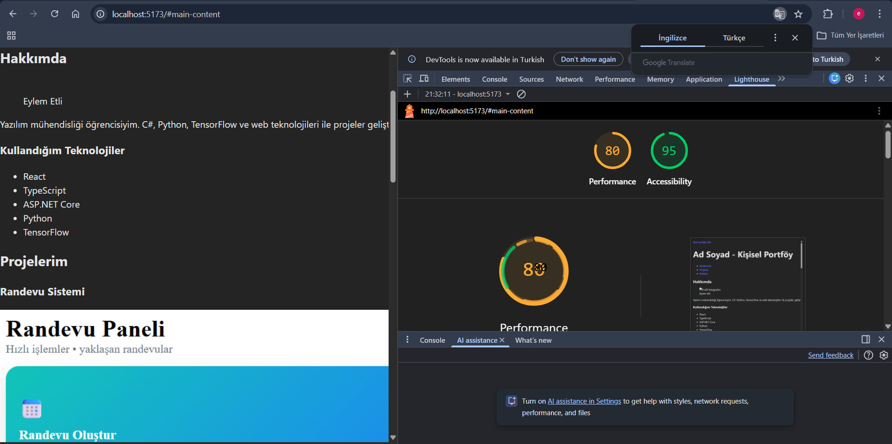

# Web LAB-1- Hello Project

 ## Hakkinda
 Bu proje, Web Tasarimi ve Programlama dersi LAB-1 kapsaminda
 Vite + React + TypeScript kullanilarak olusturulmustur.

 ## Gelistirici
- **Ad Soyad:** [Eylem Etli]
- **Ogrenci No:** [230541302]

 ## Kullanilan Teknolojiler
- React 18
- TypeScript
- Vite

 ## Kurulum
 ```bash
 npm install
 ```

 ## Calistirma
 ```bash
 npm run dev
 ```

 ## Ekran Goruntusu
 
 

 ## Özellikler
  -Semantik HTML5 (header, nav, main, section, footer)
  -Accessibility iyileştirmeleri
  -Skip link ile klavye navigasyonu
  -Lighthouse ile erişilebilirlik testi
  -Feature branch + çoklu commit akışı